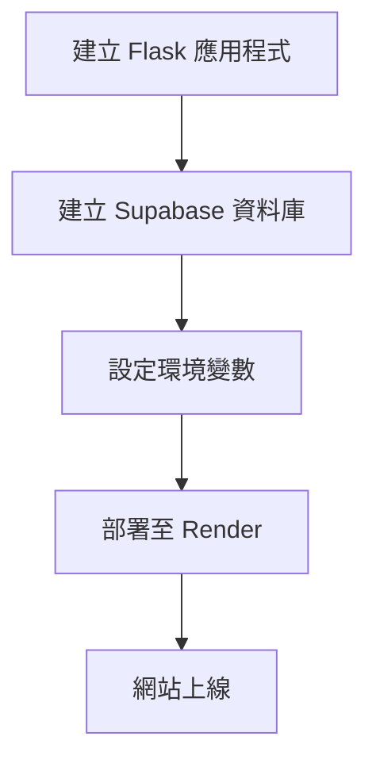
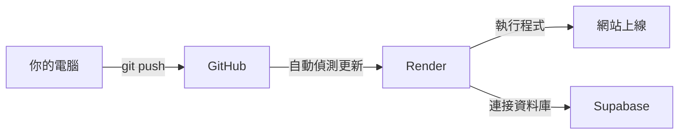
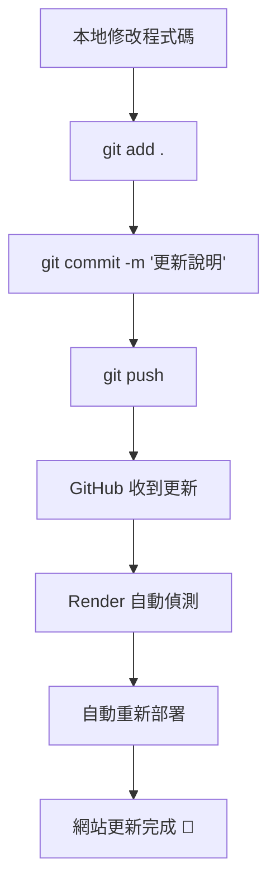

# 系統架構紀錄

---

## 一、流程



---

## 二、網站資訊

| 項目 | 說明 |
|------|------|
| 網址 | https://workplanmanager.onrender.com |
| 後端 | Flask (Python) |
| 資料庫 | Supabase (PostgreSQL) |
| 部署平台 | Render |
| 版控 | GitHub |

---

## 三、設定步驟

| 步驟 | 內容 | 工具 |
|------|------|------|
| 1 | 建立 Flask 網頁應用程式 | Python / Flask |
| 2 | 建立 PostgreSQL 資料庫 | Supabase |
| 3 | 設定環境變數連接資料庫 | DB_HOST / DB_NAME / DB_USER / DB_PASSWORD |
| 4 | 部署網頁應用程式 | Render |
| 5 | 解決 IPv6 連線問題 | Supabase Session Pooler (IPv4) |

---

### (一) 如何在 Render 切換部署分支？
方式一：在 Render Dashboard 切換（最常見、最簡單）

1. 登入 Render Dashboard
2. 點你的 Web Service
3. 左側選單選 Settings
4. 找到 Branch（或 Deploy settings）
5. 改成你要的分支（例如 dev 或 main）
6. 點 Save
7. 點右上角 Manual Deploy → Clear build cache & deploy

這樣 Render 之後就會用你選的那個分支來部署。

### (二) Render 也支援手動部署某個 commit
路徑: 你的 Service → Manual Deploy → Deploy a specific commit

### (三) 同步vscode分支

```
#指令
git fetch

```

## 四、部署方式

### (一) 部署方式說明



| 動作 | 說明 |
|------|------|
| 使用 GitHub 版控 | 專案建在一個儲存庫 |
| 上傳程式碼 | 把 app.py、requirements.txt 等推送上去 |
| 註冊 Render | https://render.com |
| 建立 Web Service | Render 連結你的 GitHub Repo |
| 設定環境變數 | 在 Render 填入 DB_HOST、DB_NAME 等 |
| 自動部署 | Render 偵測到 GitHub 更新就自動重新部署 |

---

### (二) 之後更新程式碼流程

#### 1. GitHub Repo 必要檔案

| 檔案 | 說明 |
|------|------|
| `app.py` | Flask 主程式 |
| `requirements.txt` | 套件清單 |
| `templates/` | HTML 模板資料夾 |
| `.gitignore` | 忽略不需要上傳的檔案 |

#### 2. 更新程式碼完整流程



**Step 1：修改程式碼**
```
在本地端修改 app.py 或其他檔案
```

**Step 2：確認修改了哪些檔案**
```bash
git status
```

**Step 3：把修改加入暫存區**
```bash
git add .
```

**Step 4：提交修改並寫說明**
```bash
git commit -m "修改了什麼內容"
```

**Step 5：推送到 GitHub**
```bash
git push
```

**Step 6：等待 Render 自動部署**
- 進入 Render Dashboard
- 點選你的服務
- 點選 **"Logs"** 查看部署進度
- 看到 `Your service is live 🎉` 代表完成！

---

## 五、環境變數設定

| Key | Value |
|-----|-------|
| DB_HOST | aws-1-ap-northeast-1.pooler.supabase.com |
| DB_NAME | postgres |
| DB_USER | postgres.xtqatnxwxdrycqteqriy |
| DB_PASSWORD | 密碼 |

## 六、用本機執行專案

**Step 1：建立虛擬環境**

python -m venv .venv

**Step 2：啟動**

Windows: .venv\Scripts\activate

macOS/Linux:source .venv/bin/activate

**Step 3：安裝套件**

pip install -r requirements.txt

**Step 4：啟動 Flask**

python app.py

會看到: Running on http://127.0.0.1:5000

**Step 5：瀏覽器打開**

http://127.0.0.1:5000

**Step 6：退出**

ctrl+c

deactivate

## 七、分支策略

### feature 分支
- 用途：每個新功能或修正單獨建立分支。
- 命名規則：`feature/<功能描述>` 或 `bugfix/<修正描述>`。
- 流程：完成開發後，發 Pull Request 合併到 `dev` 分支。

### dev 分支
- 用途：整合所有 feature，作為測試環境部署來源。
- 流程：dev 上的 commit 會觸發 Render 測試環境自動部署。
- 測試通過後，再整理版本合併到 main。

### main 分支
- 用途：保持永遠可發佈的穩定版本。
- 流程：只接受從 dev 合併的版本 commit，並加上版本號 tag。
- main 分支的 commit 會觸發 Render 正式環境自動部署。

---

## 八、Commit 類型規範

### 功能相關
- **feat**：新增功能，例如新增 API、UI 元件或模組
- **refactor**：程式重構，不改變功能行為，但改善結構或可讀性
- **perf**：效能優化，例如減少 API 呼叫、加快渲染速度
- **style**：程式格式調整、排版或修正縮排，不影響功能

### 修正相關
- **fix**：修正 bug 或錯誤行為
- **test**：新增或修改測試用例，確保功能正確
- **chore**：其他雜項，如更新依賴、CI 設定或自動化腳本

### 文件與說明
- **docs**：修改或新增文件，例如 README、API 文件、注釋
- **build**：編譯或建置相關變動，例如打包設定、Dockerfile
- **config**：環境或設定檔修改，例如 dev/prod 設定

---

## 九、Commit 訊息範例
```bash
feat(auth): add login API
fix(ui): correct button style
refactor(user): split user module into submodules
perf(api): reduce duplicate database queries
docs(readme): update deployment process
chore(deps): upgrade express version
test(auth): add login unit tests